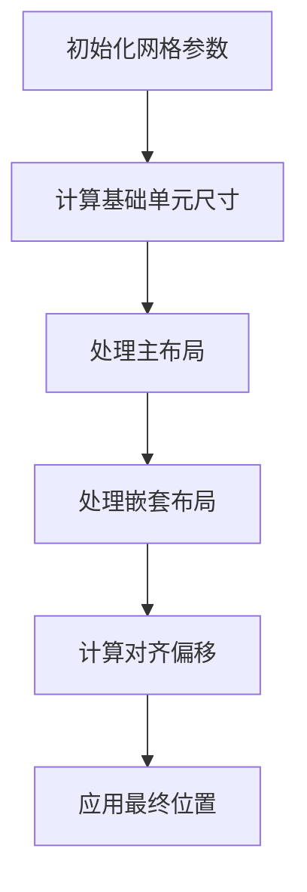

# GridUI - 声明式网格布局引擎


## 🌟 核心特性

- **多重布局模式**
  - 真实DOM布局
  - 虚拟布局（无DOM渲染）
  - 混合嵌套布局
- **智能对齐系统**
  - 9种组合对齐方式
  - 行级/容器级对齐
  - 动态偏移计算
- **响应式网格**
  - 可配置行列数
  - 自适应单元尺寸
  - 精确偏移控制
- **开发者工具**
  - 可视化网格线
  - 布局边界高亮
  - 实时位置追踪

## 🚀 快速入门

### 基础用法
```javascript
// 创建表单容器
const form = new GridUi({
  parent$: $('#app'),
  gridCols: 12,
  debug: true,
  layout: grid.middle([
    row.centerMiddle([label, BLANK_DIV(15), input]),
    row.centerMiddle([rememberCheckbox, rememberLabel]),
    row.centerMiddle([submitBtn, cancelBtn])
  ])
}).render();
```

### 核心概念
```javascript
// 空白占位元素
BLANK_DIV(width, height) 

// 行布局工具
row.center(elements)    // 水平居中
row.middle(elements)    // 垂直居中
row.right(elements)     // 右对齐

// 容器布局工具 
grid.center(rows)       // 整体水平居中
grid.middle(rows)       // 整体垂直居中
```

## 🔧 核心API

### GridUi 配置项
```javascript
{
  html: '<div>内容</div>',   // 元素模板
  parent$: $('#parent'),    // 父容器jQuery对象
  gridCols: 12,            // 总列数（默认12）
  gridRows: 10,            // 总行数（默认10） 
  layout: [],              // 布局配置数组
  style: { ... },          // 元素样式
  debug: true,             // 启用调试模式
  debugOptions: {          // 调试配置
    showRowBoundaries: true,
    rowBoundaryColor: 'rgba(0,255,0,0.2)'
  }
}
```

### 布局计算方法
```javascript
// 计算元素位置
calculateElementPosition(
  element,
  startGridLine, 
  startOffset,
  topGridLine,
  topOffset
)

// 处理嵌套布局
processNestedLayout(
  element,
  startGridLine,
  startOffset,
  topGridLine,
  topOffset
)
```

### 布局对齐系统
```javascript
// 水平对齐计算
calculateHorizontalOffset(align, totalWidth, containerWidth)

// 垂直对齐计算 
calculateVerticalOffset(align, maxHeight, containerHeight)

// 复合对齐计算
calculateAlignmentOffset(
  {horizontal, vertical},
  totalWidth,
  maxHeight,
  containerWidth,
  containerHeight
)
```

## 🛠 调试模式

### 启用调试
```javascript
new GridUi({
  debug: true,
  debugOptions: {
    showRowBoundaries: true,    // 显示行边界
    showDebugInfo: true,       // 显示调试信息
    rowBoundaryColor: 'rgba(255,0,0,0.2)' 
  }
})
```

### 调试功能
- 实时网格线显示
- 元素边界框高亮
- 动态位置追踪
- 嵌套布局可视化

## 🧩 高级功能

### 虚拟布局
```javascript
// 创建虚拟容器
const virtualContainer = new GridUi({
  isVirtual: true,
  layout: [
    [virtualElement1, virtualElement2]
  ]
});

// 混合布局
const hybridLayout = new GridUi({
  layout: [
    [realElement, virtualContainer]
  ]
});
```

### 动态布局
```javascript
// 响应式调整
function onResize() {
  form.setGridUnit(
    newWidth / gridCols,
    newHeight / gridRows
  );
  form.processLayout();
}
```

## 📚 设计理念

### 布局计算流程


### 性能优化
- **快速模式**：基于元素尺寸估算
- **精确模式**：实时布局计算
- **缓存机制**：位置信息复用
- **批量更新**：DOM操作合并

## 🖥 示例应用

### 登录表单实现
```javascript
// 参见 gridui-demo.js 完整示例
const form = new GridUi({
  layout: grid.middle([
    row.centerMiddle([userLabel, BLANK_DIV(15), userInput]),
    row.centerMiddle([pwdLabel, BLANK_DIV(15), pwdInput]),
    row.centerMiddle([rememberRow]),
    row.centerMiddle([submitBtn, cancelBtn])
  ])
});
```

## 📦 发布信息

### 依赖项
- jQuery 3.0+
- Modernizr（可选）

### 浏览器支持
- Chrome 70+
- Firefox 60+
- Edge 18+
- Safari 12+

## 📄 许可证
MIT License 